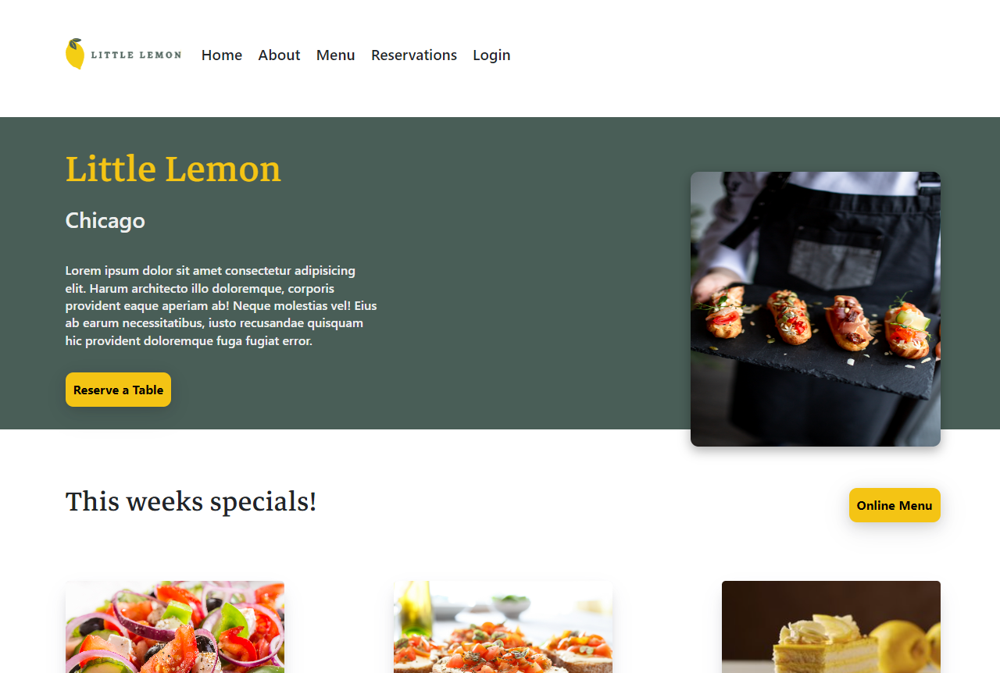
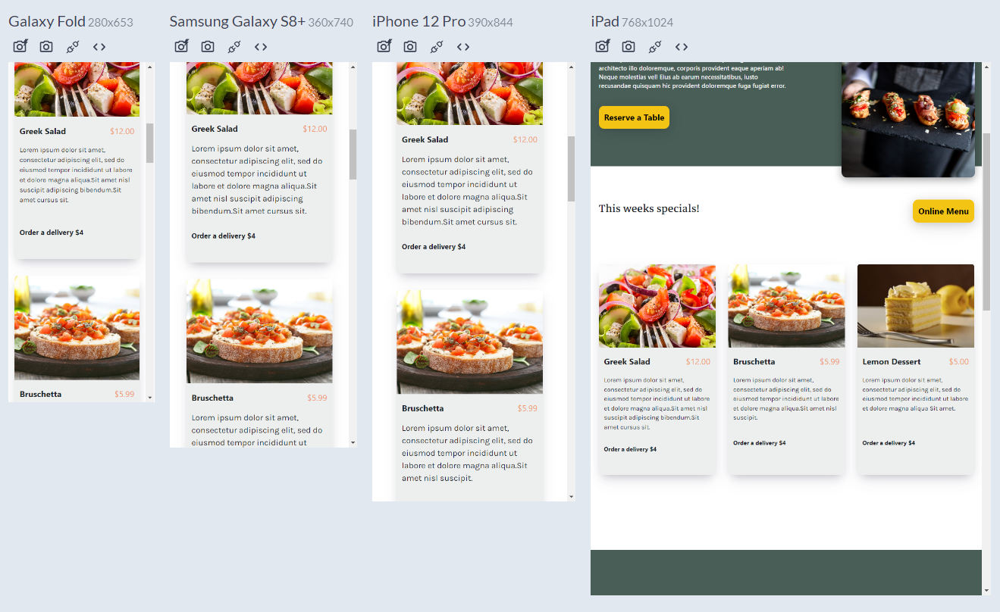
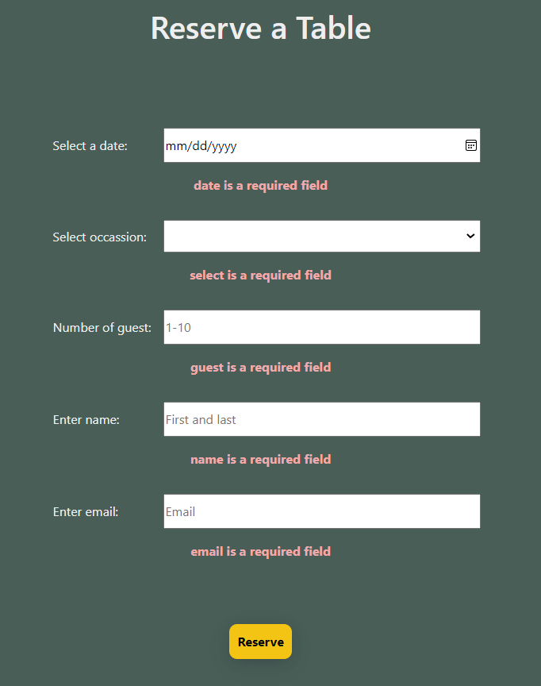

# Little Lemon Restaurant's Web App

A modern front-end landing page for a restaurant using ReactJS.

#### Tools:

- Figma
- HTML, CSS, JSX, ReactJS
- Formik, Yup
- Media queries for Mobile view

---

#### Figma

- Planning the UX/UI, applying design fundamentals
- Project Wireframing
- Create components

---

### Finished product

